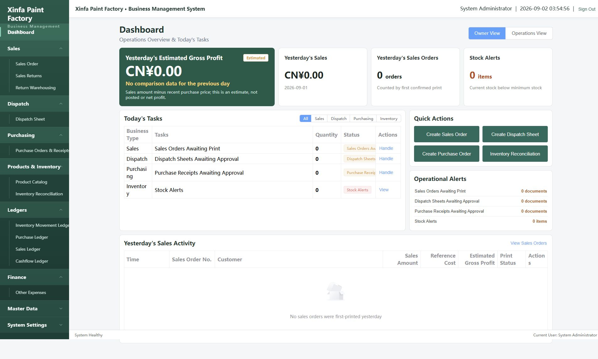
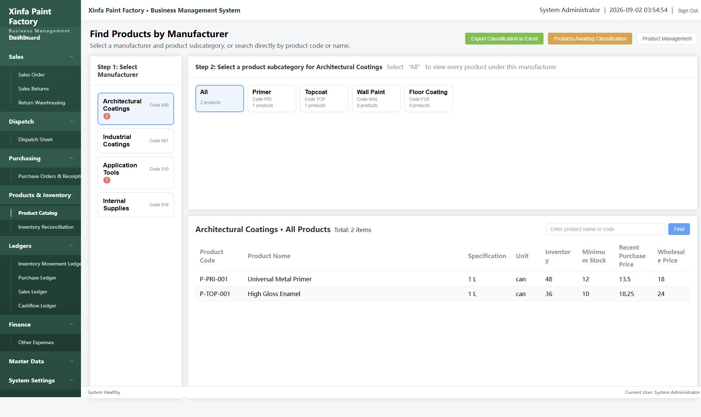
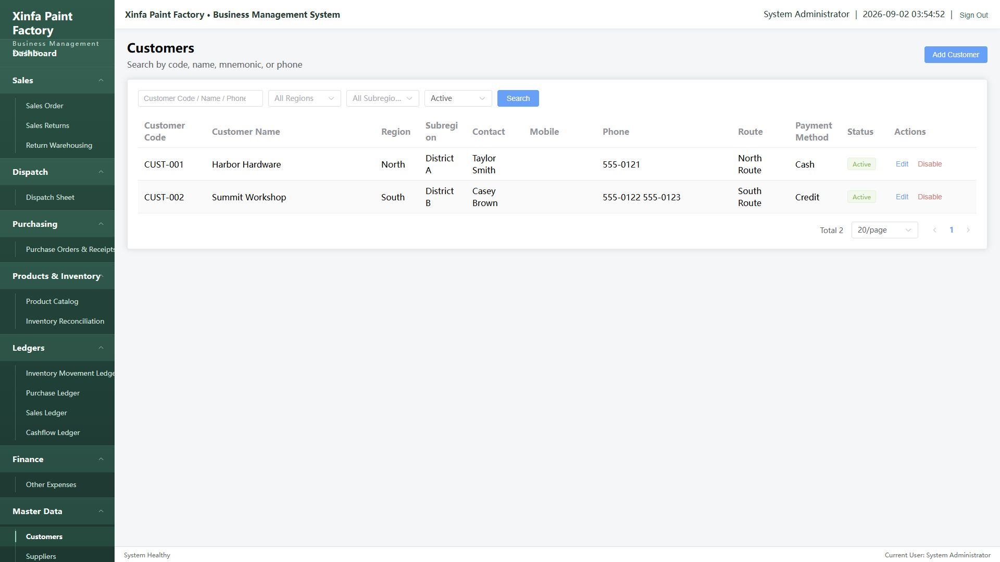

# Xinfa Paint Factory Management System

A full-stack business management application for paint and coatings distribution. This English portfolio edition demonstrates document-based sales, purchasing, dispatch, returns, inventory, expense, and ledger workflows.

> **Publication status:** English private release candidate. Tracked source, tests, migrations, documentation, demo records, public-safe screenshots, and core browser workflows have completed English acceptance. Automated backend and frontend verification passes. Public release now requires a license decision and one final history-aware secret scan. See [PUBLICATION_CHECKLIST.md](PUBLICATION_CHECKLIST.md) and [docs/BROWSER_ACCEPTANCE_REPORT.md](docs/BROWSER_ACCEPTANCE_REPORT.md).

## Features

- Authentication and user management
- Customer, supplier, employee, vehicle, route, and department records
- Product catalog and product categories
- Sales orders and delivery-note printing
- Sales returns and return warehousing
- Dispatch sheets
- Purchase orders and purchase receipts
- Inventory balances, adjustments, and movements
- Sales, purchase, inventory, and cashflow ledgers
- Other-expense documents
- Print history and audit information

## Technology stack

- Backend: Java 17, Spring Boot 3, Spring Security, JWT, MySQL 8, Flyway, Maven
- Frontend: Vue 3, TypeScript, Vite, Element Plus, Axios, Pinia, Vue Router

## Local setup

Prerequisites: Java 17, Maven 3.9+, Node.js 20+, pnpm 10, and MySQL 8.

1. Create an empty MySQL database named `paint_factory`.
2. Copy `.env.example` to a private local environment file and replace every placeholder.
3. Export the backend variables in your shell. `DB_PASSWORD` and `JWT_SECRET` are mandatory.
4. Run `mvn spring-boot:run` from `backend/`.
5. Run `pnpm install --frozen-lockfile` and `pnpm run dev` from `frontend/`.
6. Open `http://localhost:5173`.

To create the first administrator on a fresh database, temporarily set `BOOTSTRAP_ADMIN_ENABLED=true` and provide a strong `BOOTSTRAP_ADMIN_PASSWORD`. Disable bootstrap after the first successful start.

### Optional fictional demo data

After the first administrator has been created, import [`demo/demo-data.sql`](demo/demo-data.sql) into the same database. It adds only fictional English customers, suppliers, employees, products, vehicles, routes, and departments. The script intentionally does not contain an administrator password.

## Verification

```bash
cd backend && mvn test
cd ../frontend && pnpm install --frozen-lockfile && pnpm run build
```

See [docs/TESTING.md](docs/TESTING.md) and [docs/ARCHITECTURE.md](docs/ARCHITECTURE.md).

Current verified baseline:

- Backend: 78 tests executed, 0 failures, 7 optional external legacy-file cases skipped
- Frontend: TypeScript project check and Vite production build passed
- Tracked-text English scan: no Han-character matches
- Repository diff validation: passed

The exact public include/exclude list is documented in [docs/PUBLIC_REPOSITORY_CONTENTS.md](docs/PUBLIC_REPOSITORY_CONTENTS.md).

## Demo data and screenshots

Only fictional records may be added to a public build. The optional [`demo/demo-data.sql`](demo/demo-data.sql) package is safe for local demonstrations. New English screenshots must be captured from a freshly migrated database populated only with that package.

The screenshots below were captured at a 1920 × 1080 desktop viewport from a fresh isolated database populated only with the fictional demo package.

### Dashboard



### Product catalog



### Customer master data



## Security and privacy

- Never commit `.env` files, database dumps, imports, exports, logs, or customer/business data.
- The application deliberately has no default database password or JWT secret.
- Review [SECURITY.md](SECURITY.md) before deployment.

## License

No open-source license has been selected. Until a license is chosen, all rights are reserved.
